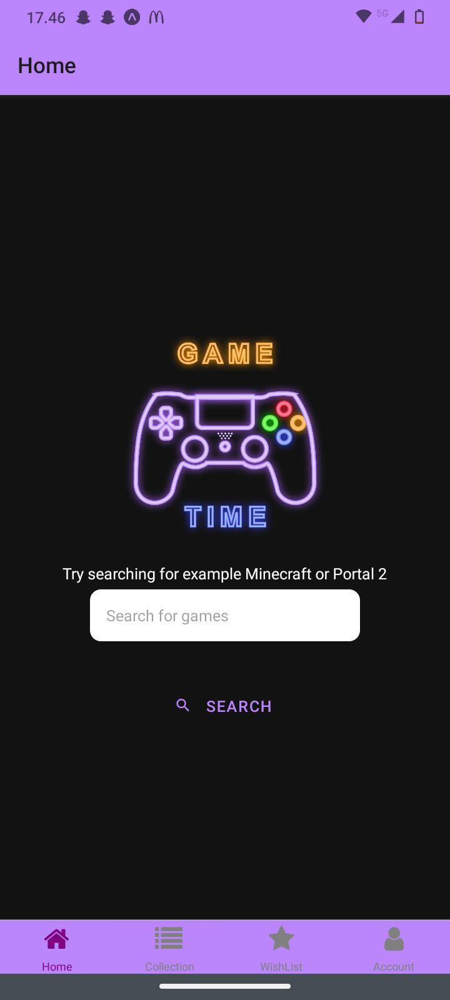
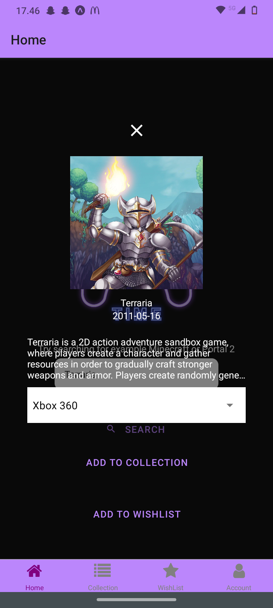
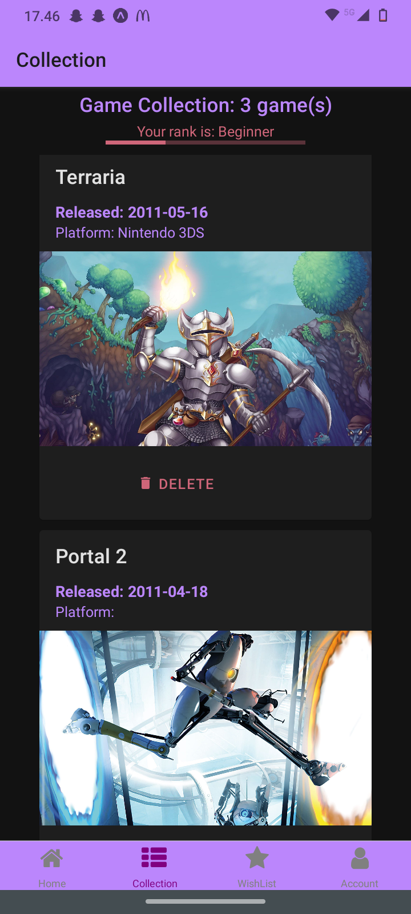
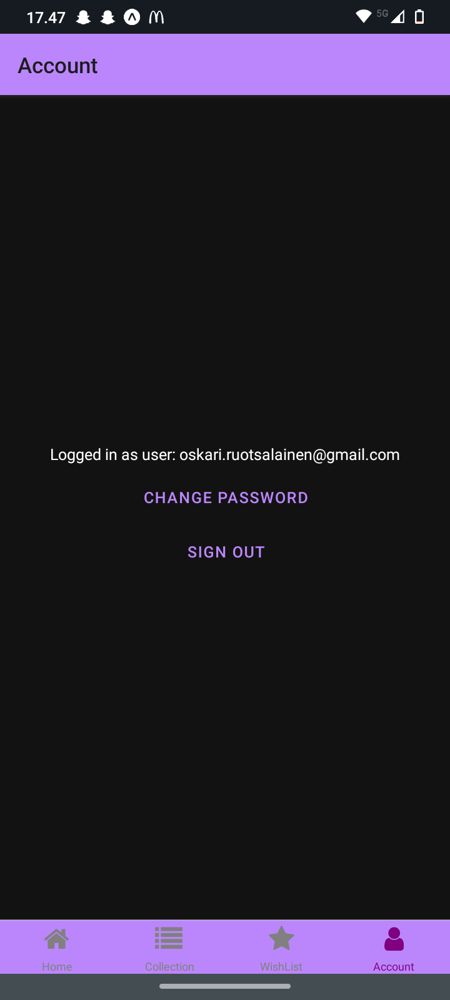
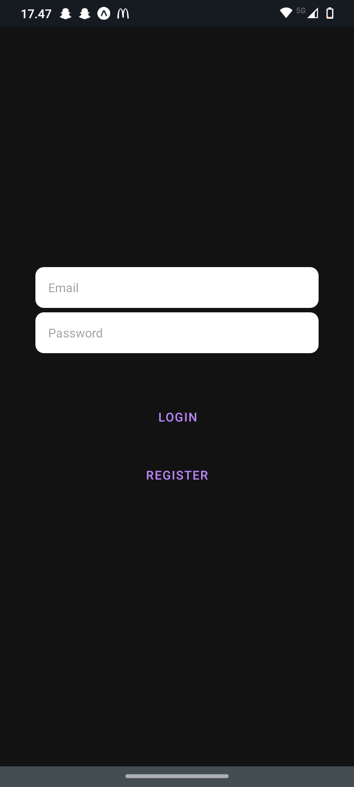
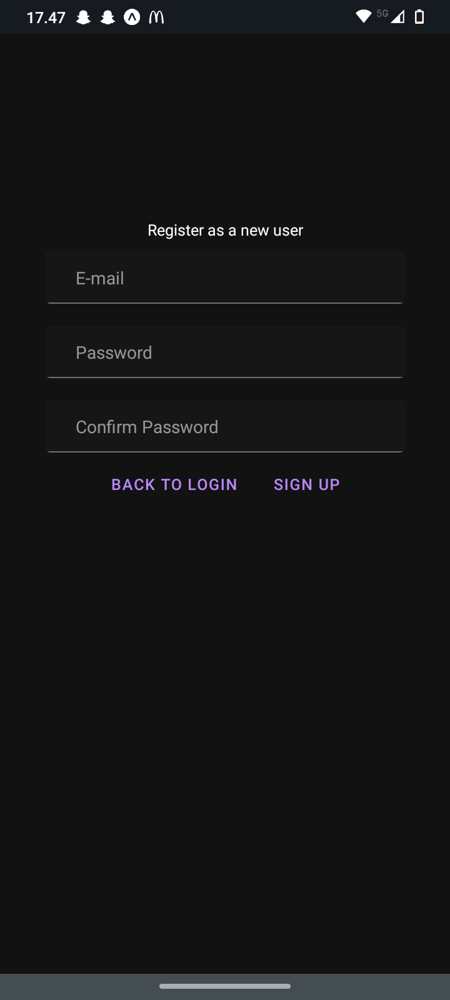

MyGames is a videogame collection program utilizing the RAWG api to collect and store video game data.

Here's the Home screen where the user can search for their favourite games.

An example of a result user got from their search.

The collection showing all of the games the user currently owns.

The progress bar above shows how far the user is from the next rank. More games equal better rank.

The wishlist enables the user to search for the game online and after buying the game adding it to the collection.

Accoung showing the current logged in user and a button to send a request to the email to change the user password.

Basic login screen.

Finally the sign up screen.

Thanks for checking out my project!

Check out a short demo of this project: https://www.youtube.com/watch?v=_INu2PRiQJ4